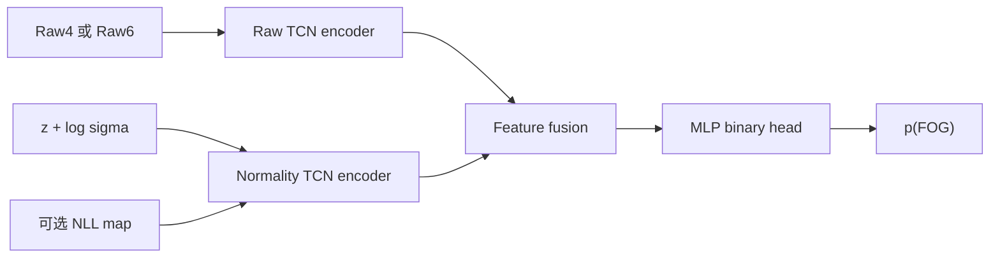

# Daphnet：2 s 因果 GRU 正常预测与残差融合 FOG 检测架构

## 1. 研究目标

用大量 non-FOG 数据训练一个概率式正常行为模型（Normal Behaviour
Model，NBM）。模型只观察过去 2 s 的三 IMU 加速度，预测随后 2 s 在
non-FOG 条件下的信号分布。实际信号到达后，计算预测创新量，再与原始信号
共同完成 FOG/non-FOG 检测。

核心定位是：

> 正常预测残差是“偏离正常动力学”的辅助表征，不是纯粹的 FOG 信号，也不应
> 默认完全替代原始 IMU。

## 2. 数据与受试者协议

### 2.1 数据

- Daphnet；
- 3 个三轴加速度计：ankle、thigh、trunk；
- 9 个加速度通道；
- 采样率 64 Hz；
- 当前数据不包含陀螺仪，论文中应写“3 个三轴加速度计”，不要泛称完整 IMU。

### 2.2 主 LOSO 队列

主实验使用 8 名包含 FOG 的受试者：

```text
S01, S02, S03, S05, S06, S07, S08, S09
```

每折：

```text
6 名训练受试者
1 名验证受试者
1 名测试受试者
```

验证受试者应按预注册的循环规则选择，并且必须含两类窗口。测试受试者不能
参与 scaler、训练、早停、模型选择、阈值选择或后处理参数选择。

S04、S10 没有 FOG。若主协议排除二者，应另外将二者作为 negative-only
外部测试，报告 specificity 和 FA/h；不能据 8 人主实验推断在纯 non-FOG
患者上的误报性能。

## 3. 预处理

### 3.1 折内 Robust Scaler

每个 LOSO fold 单独执行：

1. 仅使用 6 名训练受试者的有效 non-FOG 样本；
2. 每个通道拟合 median 和 IQR（或当前代码的稳健尺度）；
3. 固定应用于训练、验证和测试受试者；
4. 不允许验证或测试受试者参与中心、尺度或 clipping 阈值估计。

稳健标准化信号记为：

\[
\tilde{x}_{c,t}=\frac{x_{c,t}-m_c}{s_c+\epsilon}.
\]

如使用 `[-12,12]` 输入截断，应记录被截断样本比例，并设置 no-clip 消融；
截断会改变极端波形和频谱。

### 3.2 基础预测窗口

```text
context：过去 2 s = 128 点
target：随后 2 s = 128 点
anchor stride：0.25 s = 16 点
```

单个窗口：

\[
C_i=\tilde{x}_{t_i-128:t_i}\in\mathbb{R}^{9\times128},
\]

\[
X_i=\tilde{x}_{t_i:t_i+128}\in\mathbb{R}^{9\times128}.
\]

窗口不能跨记录、无效区间或数据缺口。

### 3.3 clean non-FOG 定义

阶段一训练窗口应满足：

- context 全部为有效 non-FOG；
- target 全部为有效 non-FOG；
- context 前和 target 后至少 0.5 s guard 内无 FOG；
- Daphnet 原始 annotation=0 的非实验区域不能当作 non-FOG；
- 建议增加 1 s、2 s pre/post-FOG guard 消融，检查 pre-FOG 污染。

## 4. 阶段一：概率式 GRU 因果预测器

### 4.1 输入与输出

输入：

```text
[batch, channel, context_time] = [B, 9, 128]
```

模型输出：

```text
mean     μ       [B, 9, 128]
logscale log σ   [B, 9, 128]
```

模型学习：

\[
p(X_i\mid C_i,\mathrm{nonFOG})
=
\mathcal{N}\left(\mu_i,\operatorname{diag}(\sigma_i^2)\right).
\]

`nonFOG` 表示参数只由 clean non-FOG 数据训练；推理时不需要向模型输入
真实类别标签。

### 4.2 推荐 GRU-NBM v1

```text
C_i [B,9,128]
        ↓ transpose
[B,128,9]
        ↓
1-layer GRU
input_size=9, hidden_size=48
        ↓
最后隐状态 h [B,48]
        ↓
Linear(48→48) + GELU + Dropout(0.1)
        ↓
Direct Gaussian multi-horizon decoder
Linear(48→2×9×128)
        ↓
Δμ [B,9,128]       log σ [B,9,128]
        ↓
μ = context最后一点 + Δμ
```

直接多步 decoder 不读取 target，避免训练时 teacher forcing、推理时自回归
造成额外分布差异。2 s decoder 参数量明显大于短 horizon，必须记录并报告。

推荐约束：

```text
log σ ∈ [-3.0, 1.5]
gradient clipping = 5.0
optimizer = AdamW
learning rate = 1e-3
weight decay = 1e-4
batch size = 256（按显存调整）
```

### 4.3 阶段一损失

主损失为异方差 Gaussian NLL：

\[
\mathcal{L}_{NBM}
=
\frac{1}{2}
\operatorname{mean}\left[
\exp(-2\log\sigma)(X-\mu)^2+2\log\sigma
\right].
\]

说明：

- `log σ` 的惩罚项防止模型通过无限放大不确定性降低误差；
- 主模型先只用 NLL，避免多损失权重成为额外自由度；
- derivative loss、multi-resolution STFT loss 可作为后续消融，不直接并入
  首个正式模型。

### 4.4 阶段一验证与早停

工程基线可仅使用验证受试者的 clean non-FOG 窗口：

- 主早停指标：validation Gaussian NLL；
- 辅助指标：MAE、RMSE、相关系数；
- 频谱诊断：0.5–3 Hz 和 3–8 Hz band-power error；
- 概率校准：标准化误差均值/方差、68% 和 95% 预测区间覆盖率；
- patience=3，保存 validation NLL 最低 checkpoint。

阶段一不能用测试受试者，也不应使用测试 FOG 分类性能选择 checkpoint。

更严格的论文协议应在 6 名训练受试者内部确定 NBM epoch/hyperparameter，
让外层验证受试者只承担阶段二早停、阈值和后处理选择。若同一验证受试者同时
反复用于 NBM 早停、分类器早停和阈值选择，虽然没有测试泄漏，但会增加对单一
验证患者的适配。

## 5. 防止残差训练分布泄漏

若一个高容量 NBM 在 6 名训练受试者上训练后，再为相同训练窗口生成残差，
训练 non-FOG 残差可能过于理想；验证和测试残差来自未见受试者，形成分布
错配。

正式方案使用 subject-level cross-fitting：

1. 对 6 名训练受试者进行 leave-one-training-subject-out；
2. 每个子折的 scaler 只在其中 5 人的有效 non-FOG 上拟合；
3. 每个子模型用这 5 人的 clean non-FOG 训练；
4. 为被排除的第 6 人生成 out-of-subject 训练残差；
5. 合并 6 人的 OOF 残差训练第二阶段分类器；
6. 最终 scaler 和最终 NBM 再用全部 6 名外层训练受试者拟合，只为外层验证和
   测试受试者生成表征。

这是 stacking 式标准流程。作为额外稳定性实验，也可以让验证/测试使用
\(K\) 个子模型的集成，使每个 predictor 的训练人数与 OOF 阶段一致。集成
Gaussian 可用矩匹配：

\[
\bar{\mu}=\frac1K\sum_k\mu_k,
\]

\[
\bar{\sigma}^2
=
\frac1K\sum_k(\sigma_k^2+\mu_k^2)-\bar{\mu}^2.
\]

计算资源不足时可先做 3-fold subject cross-fitting，但不能把同训练窗口
in-sample residual 与 held-out-subject residual 默认为同分布。

## 6. 实际信号与正常预测的比较

对每个 target 计算：

### 6.1 有符号预测误差

\[
e_i=X_i-\mu_i.
\]

### 6.2 标准化创新量

\[
z_i=\frac{X_i-\mu_i}{\sigma_i+\epsilon}.
\]

主模型保留有符号 \(z\)，不要只输入 \(|z|\)、\(z^2\) 或单个 RMSE。

### 6.3 Gaussian surprise / NLL map

\[
a_i
=
\log\sigma_i+\frac12z_i^2.
\]

建议保存而不是只保存一个最终 residual：

```text
raw target X
predicted mean μ
signed error e
standardized innovation z
log σ
Gaussian NLL map a
```

这样可以完成 residual-only、raw-only 和融合消融，也便于检查预测相位误差。

## 7. 分类时间支持与标签

### 7.1 预测 horizon 与分类历史不是同一个概念

推荐主分类历史为 4 s：

```text
H200 residual block：2 s
diagnostic history：最近两个互不重叠的 H200 block = 4 s
classifier input： [9,256]（单一表示）
```

在分类终点 \(T\)：

```text
预测块 1：
context [T-6,T-4] → target [T-4,T-2]

预测块 2：
context [T-4,T-2] → target [T-2,T]

分类终点：T
```

因此 4 s residual history 的完整原始因果支持为 `[T-6,T]`。任何 raw 对照
都必须同时考虑：

- `Raw4`：终点前 4 s；
- `Raw6`：与 residual 方法相同的完整 6 s 原始支持。

如果第一版只使用当前一个 H200 residual block，则输入为 `[9,128]`，应作为
`residual_h2s` 消融，而不是与 4 s residual history 混称。

### 7.2 窗口标签

无论预测 horizon 是 0.5、1 还是 2 s，分类标签固定取共同终点前最后 0.5 s：

\[
y_T
=
\mathbb{1}\left[
\frac{1}{32}\sum_{t=T-32}^{T-1}
\mathbb{1}(FOG_t)\ge0.5
\right].
\]

不能因为预测未来 2 s，就将整个 2 s target 的“任意 FOG”作为正类；否则
horizon 改变的同时也改变了分类任务和检测延迟定义。

## 8. 阶段二：Raw + Normality 双分支分类器

### 8.1 推荐主模型



推荐输入：

```text
raw branch：X
normality branch：z + log σ
可选辅助：Gaussian NLL map
```

不建议把 \(\mu\) 与 raw、z、σ 全部无控制地拼接；先使用预注册消融判断每一
组信息是否真正提供增益。

### 8.2 每个 TCN encoder

建议：

```text
1×1 Conv → 48 hidden channels
GroupNorm + GELU
6 个 residual temporal blocks
kernel size = 3
dilations = [1,2,4,8,16,32]
每块 2 个 Conv1d
dropout = 0.15
最后时刻 hidden state + recency-aware attention pooling
```

该 dilation 设置对 256 点输入的感受野约为 253 点，覆盖接近完整 4 s。
若复用仓库 TCN-M 的 `[1,2,4,8,8,8]`，应明确其局部感受野为 125 点，最终
依赖 pooling 汇总 4 s。

由于标签只描述终点前最后 0.5 s，主模型不建议只用无位置的全局 max
pooling；较早发生、但终点已结束的 FOG 可能持续触发 max feature。推荐使用
最后时刻特征与偏向近期的 attention pooling。`mean+max` 可保留为与现有
TCN-M 对齐的基线。

融合：

```text
concat(raw pooled feature, normality pooled feature)
→ Linear → GELU → Dropout
→ Linear(1)
```

阶段二训练时冻结 NBM，分类损失不能反向改变正常预测器。

### 8.3 时频信息保护

核心模型同时保留 raw，因此不会要求 residual 独自承担全部时频信息。建议
另做时频分支消融：

- raw 的 0.5–3 Hz 与 3–8 Hz 带通信号；
- z 的 0.5–3 Hz 与 3–8 Hz 带通信号；
- raw/z 的 multi-resolution STFT；
- 每个传感器的 band power、freeze index；
- actual/prediction 的交叉谱、相干性和 phase lag。

不要只输入 `PSD(actual)-PSD(prediction)`；残差功率包含相位交叉项，不是两个
功率谱的简单差。

## 9. 阶段二训练

训练数据：

- 6 名训练受试者的 OOF 表征；
- FOG 与 non-FOG 均进入阶段二；
- 不使用验证和测试窗口训练分类器。

损失：

\[
\mathcal{L}_{cls}
=
\operatorname{BCEWithLogitsLoss}(pos\_weight=w_+),
\]

\[
w_+
=
\min\left(\sqrt{\frac{N_{nonFOG}}{N_{FOG}}},6\right).
\]

建议：

```text
optimizer = AdamW
learning rate = 1e-3
weight decay = 1e-4
classifier epochs ≤ 20
early-stop metric = validation PR-AUC
patience = 4
```

PR-AUC 是无阈值指标。最终决策阈值只能在验证受试者上选择，可最大化
balanced accuracy / macro-F1，或采用“FA/h 不超过预设上限时最大化事件召回”
的部署规则。

可选 hysteresis、连续投票、最短事件时长和短间隔合并必须仅在验证集确定。

## 10. 在线推理语义

滚动部署时每 0.25 s 建立一个 forecast：

1. 在 \(t\) 观察过去 2 s，缓存对 `[t,t+2s]` 的正常预测；
2. 到 \(t+2s\) 时实际 target 已完整到达，计算该块 residual；
3. 分类终点每 0.25 s 更新一次，使用与当前终点对齐的残差块/残差历史。

因此：

- 系统启动至少需要 context 与首个 target 的 warm-up；
- 稳态时预测队列中同时存在 8 个尚未完全成熟的 2 s forecast；
- 流水线预热后每 0.25 s 都会有一个 forecast 成熟，输出频率为 4 Hz；
- 每个 residual 块严格是事后可计算的检测证据；
- 由于 forecast 以 0.25 s 滚动建立，FOG 发生后不一定固定等待完整 2 s 才有
  下一次决策；
- 但更长 horizon 会放大相位漂移和正常预测误差，可能显著提高 FA/h；
- 该系统应称“基于 2 s ahead normal forecast residual 的在线检测”，不能称
  “提前 2 s 预测 FOG”。

## 11. 必做对照与消融

### 11.1 预测 horizon

```text
H050：0.5 s
H100：1.0 s
H200：2.0 s（提出方法）
```

所有 horizon 使用相同：

- 最大 horizon 定义的 master support；
- classification endpoints；
- 最后 0.5 s 标签；
- 4 s diagnostic history；
- 分类器架构、初始化、训练顺序和阈值规则。

若单一 H200 的误报仍高，下一步优先测试 `{H050,H200}` 双 horizon，而不是
继续增大单一预测跨度。短 horizon 提供低预测误差参考，长 horizon 提供更早
形成的正常轨迹；分类器可区分“两个 horizon 都异常”和“只有长 horizon 因
相位漂移而异常”。

### 11.2 分类表示

至少包含：

| ID | 输入 | 科学问题 |
|---|---|---|
| A | Raw4 | 4 s 原始信号基线 |
| B | Raw6 | 完整因果支持控制 |
| C | Error-only | 残差能否替代 raw |
| D | Raw4 + Zero | 通道数/参数容量控制 |
| E | Raw4 + signed error | 原始误差是否提供互补信息 |
| F | Raw4 + z + log σ | 不确定性标准化是否有用 |
| G | Raw4 + Gaussian NLL | surprise map 是否有用 |
| H | Raw + normality 时频双分支 | 显式时频是否进一步增益 |

主比较不是 `E/F` 只与 A 比，还必须与 D 比，排除增加通道和参数量造成的
假增益。

## 12. 评估与统计

主指标：

- held-out-subject macro PR-AUC。

辅助窗口指标：

- Balanced Accuracy；
- Macro-F1；
- AUROC；
- FOG Recall、Precision、F1；
- Specificity、MCC。

事件指标：

- Event Sensitivity；
- False alarms per hour；
- detection delay。

统计：

- 受试者为独立单位，不能把高度重叠窗口当作独立样本；
- 报告逐受试者结果和 subject-level paired bootstrap 95% CI；
- 至少运行 3–5 个种子；
- 阈值和所有后处理参数只由验证受试者决定。

## 13. 当前仓库证据对设计的约束

已审计通过的 GRU horizon 实验中：

| Horizon | PR-AUC | Event Sensitivity | FA/h | Delay |
|---|---:|---:|---:|---:|
| 0.5 s | 0.4905 | 0.8603 | 85.042 | 0.782 s |
| 1.0 s | 0.4888 | 0.8631 | 98.993 | 0.311 s |
| 2.0 s | 0.5068 | 0.8497 | 150.462 | 0.301 s |

2 s 相对 0.5 s 的 PR-AUC 差值为：

\[
+0.0163,\qquad 95\%CI=[-0.0534,+0.0883].
\]

因此 2 s 尚未证明具有稳定 PR-AUC 优势，而且误报明显增加。新架构应把
H200 作为待验证假设，同时保留 H050/H100，不应预先宣布 2 s 更优。

相关现有实现：

- [GRU-NBM](../cnbr_fog/nbm.py)
- [GRU horizon protocol](DAPHNET_GRU_HORIZON_ABLATION.md)
- [horizon-by-fusion protocol](DAPHNET_TRANSFORMER_HORIZON_FUSION_ABLATION.md)
- [GRU horizon publication table](../outputs/daphnet_gru_horizon4_h4_tcnm_loso_seed42/publication_table.csv)

## 14. 推荐实施顺序

1. 复用现有 H200 GRU-NBM 和残差缓存逻辑；
2. 增加 subject-level cross-fitted residual 生成；
3. 完成 A–G 的 matched-support 表示消融；
4. 先检查 H200 的高 FA/h 来自预测相位误差、特定受试者还是 hard negatives；
5. 再增加 raw/residual 时频双分支；
6. 最后做多种子、S04/S10 negative-only、跨数据集和低 FOG 标签比例实验。
