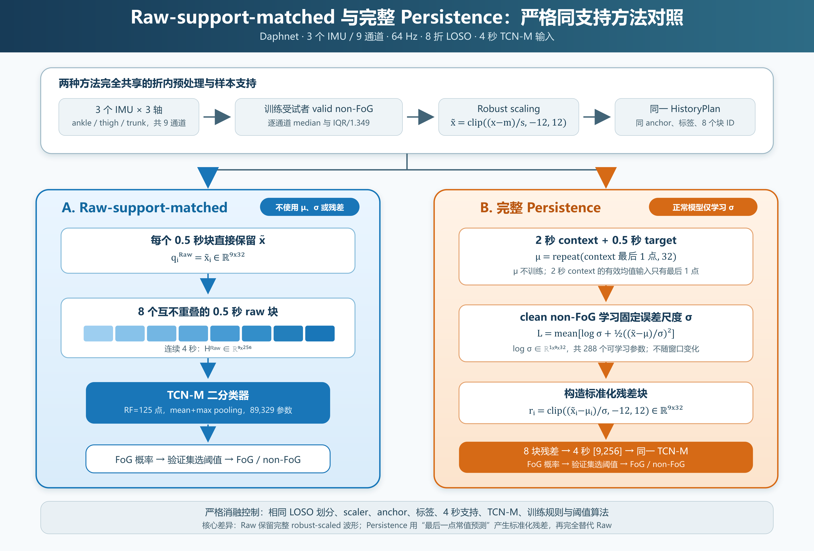
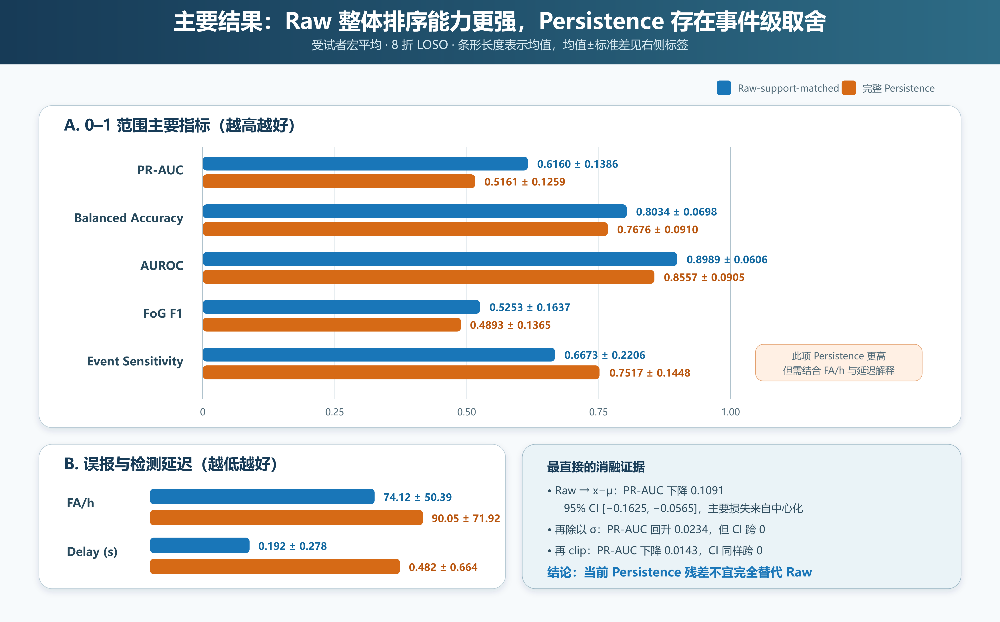

# Raw-support-matched 与完整 Persistence 方法对照

> 用途：向导师说明两种方法的输入、训练内容、公平性控制、实验结果和后续研究问题。  
> 数据集：Daphnet；3 个 IMU、9 个加速度通道；64 Hz；排除 S04、S10；8 折 LOSO。

## 一页结论

两种方法使用完全相同的受试者划分、Robust Scaler、时间 anchor、标签、4 秒
样本支持、TCN-M 分类器和阈值选择方法，唯一核心差异是送入 TCN-M 的表示：

- **Raw-support-matched**：保留 Robust-scaled 的连续 4 秒原始 IMU；
- **完整 Persistence**：用 target 前最后一点作为未来 0.5 秒常值预测，计算
  标准化预测残差，再用 4 秒残差完全替代 Raw。

当前严格消融结果表明：

1. Raw-support-matched 在 PR-AUC、BA、Macro-F1、AUROC、FoG Recall、FoG F1、
   FA/h 和检测延迟上更优；
2. Persistence 的 Event Sensitivity 更高，但同时产生更多误报和更长延迟；
3. PR-AUC 的主要损失发生在 \(x-\mu\) 这一步，而不是后续的
   \(\sigma\) 标准化或 clipping；
4. 这说明**当前 Persistence 残差不适合作为 Raw 的完全替代品**，但不能据此
   推断“正常行为建模没有价值”。更合理的后续方向是 Raw 与正常偏离信息融合。

## 1. 完整流程图

### 需要特别强调的时间关系

- 每隔 **0.25 秒**建立一个新的 target 和分类 anchor；
- 每个 target 长 **0.5 秒**，即 32 点；
- 单个 TCN-M 输入内部选择 8 个互不重叠的 0.5 秒块，构成连续 **4 秒**；
- 相邻两次分类决策相隔 0.25 秒，所以相邻的 4 秒输入彼此重叠；
- Persistence 必须等实际 target 到达后才能计算残差，因此这里是
  **FoG 检测**，不是提前 0.5 秒的 FoG 预测。

## 2. 两种方法共享的预处理

### 2.1 LOSO 折内 Robust Scaler

对当前 LOSO 折的训练受试者，仅选取：

\[
(\text{label}=0)\land(\text{valid})
\]

的采样点。逐通道计算：

\[
m_c=\operatorname{median}(x_c),
\qquad
s_c=\frac{Q_{75,c}-Q_{25,c}}{1.349}.
\]

随后对 context 和 target 使用：

\[
\tilde{x}_{c,t}
=
\operatorname{clip}
\left(
\frac{x_{c,t}-m_c}{s_c},
-12,12
\right).
\]

因此本文所说的 Raw 并不是物理单位下未经处理的信号，而是
**由训练折 non-FoG 数据确定参考中心和尺度后的 Raw**。

### 2.2 公平性控制

两种方法严格共享：

| 控制项 | 设置 |
|---|---|
| 数据划分 | 相同 train、validation、held-out test subjects |
| Scaler | 相同折内 non-FoG Robust Scaler |
| 时间支持 | 相同 anchor 和相同 8 个 0.5 秒块 ID |
| 标签 | 相同最后 target 块标签 |
| 输入形状 | `[batch, 9, 256]` |
| 分类器 | 相同 TCN-M，RF=125 点，89,329 参数 |
| 分类器训练 | 相同损失、优化器、类别权重、seed 和 early stopping |
| 阈值 | 各自在 validation subject 上按相同算法选择 |

因此两组结果的差异可以归因于**输入表示**，而不是样本数量或建窗方式。

## 3. Raw-support-matched 方法

对每个 0.5 秒 target，直接取：

\[
q_i^{Raw}=\tilde{x}_i\in\mathbb{R}^{9\times32}.
\]

再将 8 个目标起点相隔 0.5 秒的块按时间拼接：

\[
H_i^{Raw}
=
\operatorname{concat}
\left(
\tilde{x}_{i,1},\ldots,\tilde{x}_{i,8}
\right)
\in\mathbb{R}^{9\times256}.
\]

最后：

\[
H_i^{Raw}
\rightarrow
\text{TCN-M}
\rightarrow
p(\mathrm{FoG})
\rightarrow
\text{validation threshold}.
\]

### Raw-support-matched 使用和不使用什么

| 项目 | 是否使用 |
|---|---:|
| non-FoG Robust Scaler | 是 |
| Persistence 均值 \(\mu\) | 否 |
| 正常误差尺度 \(\sigma\) | 否 |
| 残差空间 clipping | 否 |
| FoG/non-FoG 监督分类 | 是 |

它仍然间接使用了 non-FoG 先验，因为 Robust Scaler 的中心和尺度来自训练折
non-FoG 样本；但它没有额外建立预测式正常行为模型。

## 4. 完整 Persistence 方法

### 4.1 固定均值预测

每个样本包含 2 秒 context 和紧随其后的 0.5 秒 target。Persistence 的均值为：

\[
\mu_i
=
\operatorname{repeat}
\left(
\tilde{x}_{context,i}[:,-1],
32
\right)
\in\mathbb{R}^{9\times32}.
\]

即把 context 最后一个采样点重复 32 次。这里：

- \(\mu\) **没有可学习参数**；
- 虽然接口提供 2 秒 context，但均值预测实际只用最后 1 点；
- 它假设未来 0.5 秒信号保持不变。

### 4.2 clean non-FoG 学习 \(\sigma\)

Persistence 唯一可学习的参数是：

\[
\log\sigma\in\mathbb{R}^{1\times9\times32},
\]

共 \(9\times32=288\) 个参数。clean non-FoG 窗口要求完整 context、target 以及
前后 0.5 秒 guard 内均没有 FoG。

训练损失为 Gaussian NLL：

\[
\mathcal{L}_{NBM}
=
\operatorname{mean}
\left[
\log\sigma
+
\frac{1}{2}
\left(
\frac{\tilde{x}_{target}-\mu}{\sigma}
\right)^2
\right].
\]

忽略有限训练轮次、边界约束和 weight decay 时，学到的
\(\sigma_{c,k}\) 近似为 clean non-FoG Persistence 预测误差在
“通道 × 预测步”上的 RMS。

\(\sigma\) 是每个 LOSO fold 单独学习的固定尺度：

- 随通道和未来预测步变化；
- 不随当前窗口、步态速度或步态阶段变化；
- 在推理时对所有窗口广播使用。

### 4.3 标准化残差和 TCN-M

完整 Persistence 块级表示为：

\[
r_i
=
\operatorname{clip}
\left(
\frac{\tilde{x}_i-\mu_i}{\sigma},
-12,12
\right)
\in\mathbb{R}^{9\times32}.
\]

拼接 8 个非重叠块：

\[
H_i^{Persistence}
=
\operatorname{concat}(r_{i,1},\ldots,r_{i,8})
\in\mathbb{R}^{9\times256},
\]

然后输入与 Raw 组完全相同的 TCN-M。

### 完整 Persistence 分成两类训练

| 阶段 | 使用的数据 | 实际学习内容 |
|---|---|---|
| 正常行为阶段 | clean non-FoG windows | 仅学习 288 个 \(\log\sigma\) |
| 分类阶段 | FoG + non-FoG windows | TCN-M 学习二分类决策 |

因此准确描述应为：

> Persistence 的均值预测是固定启发式规则；正常数据只训练预测误差尺度
> \(\sigma\)；完整残差最终交给监督式 TCN-M 分类。

## 5. 主要结果

| 指标 | Raw-support-matched | 完整 Persistence | 结果方向 |
|---|---:|---:|---|
| Accuracy | **0.7858 ± 0.1101** | 0.7662 ± 0.1503 | Raw 更高 |
| Balanced Accuracy | **0.8034 ± 0.0698** | 0.7676 ± 0.0910 | Raw 更高 |
| Macro-F1 | **0.6868 ± 0.1040** | 0.6614 ± 0.1203 | Raw 更高 |
| AUROC | **0.8989 ± 0.0606** | 0.8557 ± 0.0905 | Raw 更高 |
| PR-AUC | **0.6160 ± 0.1386** | 0.5161 ± 0.1259 | Raw 更高 |
| FoG Recall | **0.8429 ± 0.1618** | 0.7677 ± 0.1350 | Raw 更高 |
| FoG F1 | **0.5253 ± 0.1637** | 0.4893 ± 0.1365 | Raw 更高 |
| Event Sensitivity | 0.6673 ± 0.2206 | **0.7517 ± 0.1448** | Persistence 更高 |
| FA/h | **74.12 ± 50.39** | 90.05 ± 71.92 | Raw 更低 |
| Detection Delay | **0.192 ± 0.278 s** | 0.482 ± 0.664 s | Raw 更短 |

完整 Persistence 相对 Raw 的 PR-AUC 差值为：

\[
\Delta PR\text{-}AUC
=
-0.0999,
\qquad
95\%\ CI=[-0.1677,-0.0377].
\]

### 输入表示消融给出的机制证据

| 变化 | PR-AUC | 相对前一步变化 | 解释 |
|---|---:|---:|---|
| Raw | 0.6160 | — | 完整 robust-scaled 波形 |
| \(x-\mu\) | 0.5069 | **−0.1091** | 主要性能损失发生在中心化 |
| \((x-\mu)/\sigma\) | 0.5303 | +0.0234 | 有一定恢复，但 CI 跨 0 |
| 再 clip 到 `[-12,12]` | 0.5161 | −0.0143 | 没有提高 PR-AUC |

\(x-\mu\) 相对 Raw 的配对差值 95% CI 为：

\[
[-0.1625,-0.0565],
\]

是当前最明确的消融证据。

## 6. 如何理解这个结果

### 6.1 当前实验能够支持的结论

1. 在严格相同样本支持下，TCN-M 更能利用完整的 robust-scaled IMU 波形；
2. Persistence 的局部中心化删除了对 FoG 分类有用的信息；
3. \(\sigma\) 标准化只能部分弥补该损失；
4. Persistence 在当前阈值下具有更高的事件覆盖率，但代价是更高 FA/h 和更长延迟；
5. 完整残差不适合完全替代 Raw。

### 6.2 当前实验不能支持的结论

1. 不能说“正常行为学习没有价值”；
2. 不能说 Raw 完全没有使用 non-FoG 信息，因为其 Robust Scaler 来自 non-FoG；
3. 不能说所有 NBM 都不如 Raw，当前结论直接针对这套 Persistence 表示；
4. 不能仅凭 Event Sensitivity 判断 Persistence 更好，必须同时考虑误报和延迟；
5. 不能把当前方法描述为提前预测 FoG，它是在 target 到达后执行检测。

### 6.3 Raw 可能保留而 Persistence 删除的信息

- 绝对姿态与重力投影；
- 慢变运动幅值和身体倾斜；
- 步态基线和块间连续趋势；
- 原始信号的方向、相位和低频结构。

Raw-TCN 可以按需要自行学习差分或高通特征；残差输入没有同时提供 \(\mu\)，
因此无法恢复已经删除的信息。

## 7. 建议向导师讨论的问题

### 问题一：论文是否应从“残差替代 Raw”改为“正常性辅助 Raw”？

推荐候选：

\[
h_{raw}=TCN_{raw}(\tilde{x}_{4s}),
\]

\[
a
=
\log\sigma
+
\frac12
\left(
\frac{\tilde{x}-\mu}{\sigma}
\right)^2,
\qquad
h_{normal}=TCN_{normal}(a_{4s}),
\]

\[
p(\mathrm{FoG})
=
Classifier([h_{raw},h_{normal}]).
\]

这样 Raw 保留完整信息，NBM 提供“偏离正常行为的程度”。

### 问题二：是否采用真正利用 context 的学习型 NBM？

Persistence 的 \(\mu\) 没有训练。若要强调正常行为模型，可考虑：

- 因果 TCN；
- GRU；
- Transformer；
- masked-span reconstruction 预训练。

已有 context 实验中，Transformer-C4 是学习型 NBM 残差路线的最佳候选，
但仍需在严格 matched-support 条件下检验其与 Raw 的融合效果。

### 问题三：论文是否强调标签效率，而不仅是最高准确率？

为了证明“大量 non-FoG 数据被有效利用”，建议补充：

1. 固定 FoG 标签，使用 10%、25%、50%、100% non-FoG 预训练数据；
2. 固定全部 non-FoG 预训练，只使用 10%、25%、50%、100% FoG 事件标签；
3. 绘制 PR-AUC 随正常数据量和 FoG 标签量变化的曲线。

若全标签条件下与 Raw 相近，但低 FoG 标签条件下明显更优，仍能形成有力的
“label-efficient normal-behaviour learning”论文结论。

## 8. 推荐的最小后续实验

| ID | 方法 | 科学问题 |
|---|---|---|
| A | Raw-TCN-M，从头训练 | 强监督基线 |
| B | non-FoG 预训练 TCN-M → Raw 微调 | 正常预训练是否有效 |
| C | NBM-NLL only | 正常偏离能否独立识别 FoG |
| D | Raw + NBM-NLL | 正常偏离是否提供互补信息 |
| E | 当前 Persistence residual-only | 残差替代基线 |
| F | Raw + zero-map | 控制融合模型的输入维数和参数量 |

主比较：

- B vs A：正常预训练贡献；
- D vs B：正常偏离信息贡献；
- D vs E：融合相对残差替代的贡献；
- D vs F：排除增加输入通道和参数量带来的假增益。

## 9. 适合口头汇报的 60 秒版本

> 两组使用完全相同的 LOSO 划分、non-FoG Robust Scaler、样本支持和
> TCN-M。Raw-support-matched 直接输入连续 4 秒 robust-scaled IMU。
> Persistence 则取每个 target 前最后一点作为未来 0.5 秒均值，均值本身
> 不训练，只用 clean non-FoG 学习 9×32 个固定误差尺度，再把标准化残差
> 拼成 4 秒输入。结果 Raw 的 PR-AUC 是 0.616，Persistence 是 0.516；
> 消融表明主要损失来自减去均值这一步。Persistence 的事件敏感度略高，
> 但误报更多、延迟更长。因此目前不能说正常行为模型无效，而应当说：
> 用残差完全替代 Raw 会丢失信息。下一步希望保留 Raw，同时将学习到的
> 正常性 NLL 或正常表征作为辅助分支，并通过低 FoG 标签实验验证它能否
> 真正利用大量 non-FoG 数据。

## 10. 代码与结果依据

- Robust Scaler：
  [`cnbr_fog/data.py`](../cnbr_fog/data.py)
- Persistence 与 Gaussian NLL：
  [`cnbr_fog/nbm.py`](../cnbr_fog/nbm.py)
- 输入表示严格消融：
  [`scripts/run_daphnet_persistence_input_ablation.py`](../scripts/run_daphnet_persistence_input_ablation.py)
- 主要结果：
  [`publication_table.csv`](../outputs/daphnet_persistence_input_ablation_h4_tcnm_stride025_loso_seed42/publication_table.csv)
- 完整实验说明：
  [`DAPHNET_PERSISTENCE_INPUT_REPRESENTATION_ABLATION.md`](DAPHNET_PERSISTENCE_INPUT_REPRESENTATION_ABLATION.md)
