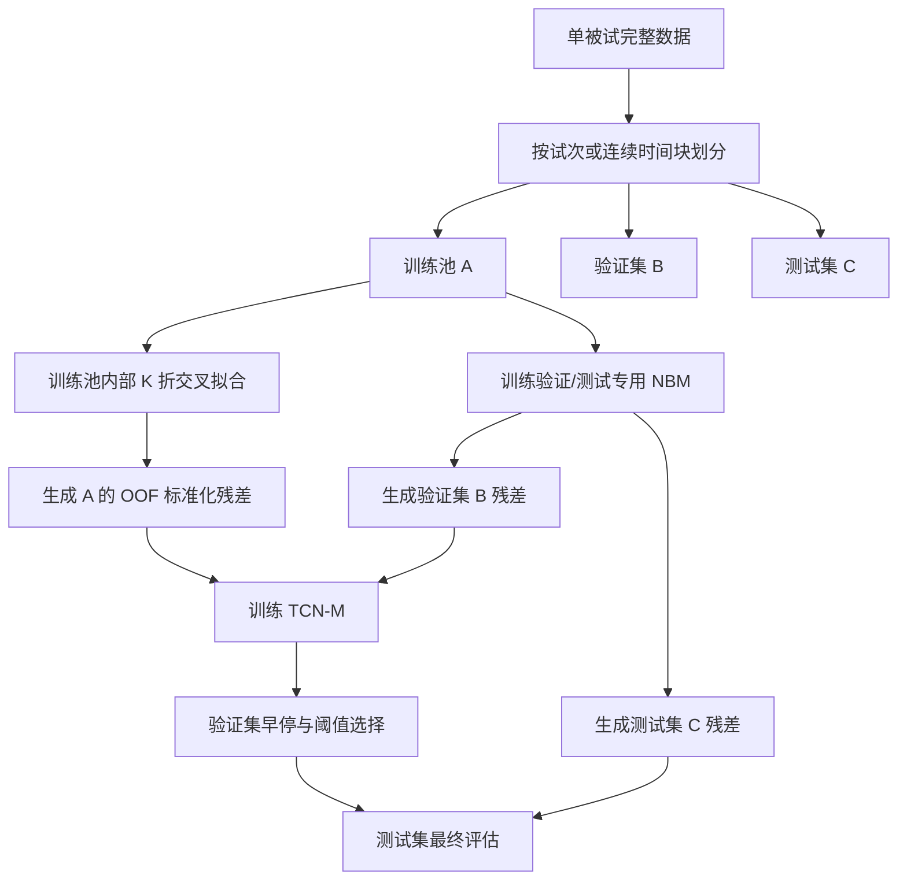

# Non-FoG GRU-NBM + TCN-M 第一版单被试内验证方案

## 1. 方案定位

### 1.1 验证目标

验证以下正常行为残差分类链路在**单被试内 FoG / non-FoG 二分类**中的可行性：

```text
原始 2 秒窗口 X：9 × 128
        ↓
训练集拟合的 RobustScaler
        ↓
去噪瓶颈 GRU-NBM
        ↓
μ：non-FoG 条件重构
        ↓
独立 non-FoG 校准数据估计 b、σ
        ↓
r = clip((X - μ - b) / σ, -12, 12)
        ↓
单分支 2 秒 TCN-M
        ↓
FoG / non-FoG
```

本方案只验证一个固定架构，不进行消融实验。

### 1.2 核心约束

必须满足以下原则：

1. GRU-NBM 只使用 non-FoG 数据训练。
2. NBM 训练窗口不能直接用于生成 TCN-M 的训练残差。
3. TCN-M 训练残差必须通过**训练池内部的交叉拟合**生成。
4. RobustScaler、NBM、残差中心 \(b\) 和残差尺度 \(\sigma\) 均不能接触测试集。
5. 外层训练集、验证集和测试集必须按独立试次、连续记录或连续时间块划分，不能随机拆分高度重叠窗口。
6. 所有模型选择、早停和分类阈值选择只能使用验证集，测试集只评估一次。

---

## 2. 输入与标签定义

### 2.1 原始输入

每个样本为一个 2 秒窗口：

\[
X \in \mathbb{R}^{9 \times 128}
\]

对应：

- 3 个 IMU；
- 每个 IMU 3 个通道；
- 共 9 个通道；
- 每个窗口 128 个采样点；
- 对应采样率为 64 Hz。

PyTorch 中统一整理为：

```python
X.shape == [batch_size, 128, 9]
```

输入 GRU 时使用：

```text
[Batch, Time, Channel]
```

输入 TCN-M 时转置为：

```text
[Batch, Channel, Time] = [B, 9, 128]
```

### 2.2 标签

窗口标签定义为：

```text
0：non-FoG
1：FoG
```

NBM 训练窗口必须满足：

- 128 个采样点全部为 non-FoG；
- 不包含 FoG 起止边界；
- 不包含 pre-FoG；
- 不包含标签不确定区域；
- 不包含严重缺失、长时间插值或明显传感器异常。

建议在每个 FoG 事件前后设置保护区：

\[
\delta = 1\sim2\text{ s}
\]

处于保护区内的 non-FoG 窗口不进入 NBM 训练集和 \(\sigma\) 校准集，但可以根据最终二分类标签规则决定是否进入 TCN-M 分类样本。

---

## 3. 单被试数据划分

## 3.1 外层划分

针对一个被试，将其全部记录按以下优先级划分：

1. 独立采集试次；
2. 独立任务段；
3. 独立连续记录；
4. 只有一条长记录时，按连续时间块划分。

推荐比例：

```text
训练池 A：70%
验证集 B：15%
测试集 C：15%
```

要求：

- B 和 C 中均应尽量包含 FoG 与 non-FoG；
- FoG 事件本身不能被拆到两个集合；
- 同一个 FoG 事件前后产生的重叠窗口只能属于同一集合；
- 相邻集合之间保留至少 2 秒保护间隔，推荐 4 秒；
- 跨越划分边界的窗口全部删除。

### 3.2 禁止的划分方式

禁止先生成所有重叠窗口，再随机执行：

```python
train_test_split(windows, shuffle=True)
```

原因是相邻窗口可能共享 50% 甚至更多原始采样点，会导致训练集和测试集近乎重复。

### 3.3 数据量不足时的处理

如果独立试次数量不足，采用连续时间块划分：

```text
前 70% 连续区域 → 训练池 A
中间 15% 连续区域 → 验证集 B
最后 15% 连续区域 → 测试集 C
```

但应优先根据 FoG 事件位置调整分界，确保验证集和测试集中存在可评估的 FoG 事件。

---

## 4. 总体训练流程



---

# 5. RobustScaler

## 5.1 拟合范围

RobustScaler 只能使用当前 NBM 拟合数据中的纯 non-FoG 样本计算。

对于第 \(c\) 个通道：

\[
X^s_{c,t}
=
\frac{X_{c,t}-m_c}{IQR_c+\epsilon}
\]

其中：

\[
IQR_c = Q_{75,c}-Q_{25,c}
\]

保存：

```text
median：9 维
IQR：9 维
```

### 5.2 严格要求

- 交叉拟合的每个内层折必须单独拟合 Scaler；
- Scaler 不能使用该折待生成残差的数据；
- 验证集和测试集共用一个由训练池 A 拟合的固定 Scaler；
- 验证集和测试集不能重新拟合 Scaler；
- Scaler 不能使用 FoG 样本拟合。

---

# 6. GRU-NBM 架构

## 6.1 固定网络结构

第一版采用单向去噪 GRU 自编码器：

```text
输入：[B, 128, 9]
  ↓
GRU Encoder
input_size = 9
hidden_size = 64
num_layers = 1
  ↓
取最后时刻隐状态 h
  ↓
Linear：64 → 16
  ↓
瓶颈向量 z：[B, 16]
  ↓
Linear：16 → 64
  ↓
将初始解码状态扩展至 128 个时刻
  ↓
GRU Decoder
input_size = 9
hidden_size = 64
num_layers = 1
  ↓
Linear：64 → 9
  ↓
μ：[B, 128, 9]
```

推荐解码方式：

- Decoder 每个时刻输入零向量或固定起始向量；
- 瓶颈映射后的向量作为 Decoder 初始隐藏状态；
- 输出完整 128 点 non-FoG 重构序列。

不使用双向 GRU，以便后续向实时部署迁移。

## 6.2 输出定义

NBM 第一版只输出：

\[
\mu = f_\theta(\widetilde X)
\]

不让网络直接输出 \(\sigma\)。

这里的 \(\mu\) 表示：

> 在当前训练分布下，GRU-NBM 对输入窗口对应的 non-FoG 正常行为模式的条件重构。

不能将其表述为绝对真实或唯一的“理想步态”。

---

# 7. NBM 输入扰动

## 7.1 训练输入与目标

训练时：

\[
\widetilde X = \mathcal{A}(X^s)
\]

网络输入为扰动信号：

\[
\widetilde X
\]

训练目标仍为干净信号：

\[
X^s
\]

即：

```text
扰动后的 non-FoG → GRU-NBM → 干净 non-FoG
```

## 7.2 第一版固定扰动策略

每个训练窗口随机选择一种状态：

```text
40%：不添加扰动
40%：添加轻度高斯噪声
20%：连续时间遮挡
```

### 高斯噪声

\[
\eta \sim \mathcal{N}(0, 0.04^2)
\]

\[
\widetilde X = X^s + \eta
\]

由于输入已经 Robust Scaling，因此噪声标准差 0.04 为无量纲值。

### 连续时间遮挡

- 随机选择 1 个时间片段；
- 长度为 4～8 个采样点；
- 9 个通道同时遮挡；
- 遮挡值设为 0。

验证、校准、生成残差和测试时均不添加任何扰动。

---

# 8. μ 的训练

## 8.1 损失函数

使用 Huber Loss：

\[
\mathcal{L}_{\mu}
=
\frac{1}{128 \times 9}
\sum_{t=1}^{128}
\sum_{c=1}^{9}
\operatorname{Huber}
\left(
X^s_{t,c}-\mu_{t,c}
\right)
\]

PyTorch：

```python
criterion = torch.nn.SmoothL1Loss(beta=1.0)
```

## 8.2 固定训练参数

```yaml
optimizer: AdamW
learning_rate: 0.001
weight_decay: 0.0001
batch_size: 128
max_epochs: 50
early_stopping_patience: 8
gradient_clip_norm: 1.0
scheduler: ReduceLROnPlateau
scheduler_factor: 0.5
scheduler_patience: 3
minimum_learning_rate: 0.00001
random_seed: 20260802
```

## 8.3 NBM 早停

NBM 验证集必须：

- 只包含纯 non-FoG；
- 不参与当前 NBM 参数训练；
- 不添加扰动；
- 使用与训练集相同的 Scaler。

监控指标：

```text
validation Huber loss
```

保存验证损失最低的 NBM 权重。

---

# 9. b 和 σ 的校准

## 9.1 校准数据

在 NBM 训练完成并冻结后，使用独立的纯 non-FoG 校准数据：

\[
X_{\mathrm{cal}}
\]

校准数据不能参与该 NBM 的梯度训练。

无扰动输入 NBM：

\[
\mu_{\mathrm{cal}}
=
f_\theta(X^s_{\mathrm{cal}})
\]

计算残差：

\[
e_{i,t,c}
=
X^s_{i,t,c}
-
\mu_{i,t,c}
\]

## 9.2 残差中心

逐通道计算：

\[
b_c
=
\operatorname{median}_{i,t}(e_{i,t,c})
\]

得到：

\[
b \in \mathbb{R}^{9}
\]

## 9.3 残差尺度

逐通道使用 MAD：

\[
\sigma_c
=
1.4826
\operatorname{median}_{i,t}
\left(
|e_{i,t,c}-b_c|
\right)
\]

得到：

\[
\sigma \in \mathbb{R}^{9}
\]

设置下限：

\[
\sigma_c
\leftarrow
\max(\sigma_c,0.05)
\]

第一版只估计逐通道固定 \(\sigma_c\)，不估计逐时间点 \(\sigma_{t,c}\)。

原因是不同窗口没有按步态相位严格对齐，同一个时间索引不对应固定的生理步态阶段。

---

# 10. 训练池内部交叉拟合

这是本方案避免“NBM 训练样本直接生成 TCN 训练残差”的关键步骤。

## 10.1 训练池分块

将训练池 A 按独立试次或连续时间块划分为：

\[
K=5
\]

个互斥块：

```text
A1、A2、A3、A4、A5
```

要求：

- 同一原始窗口只能进入一个块；
- 同一个 FoG 事件只能进入一个块；
- 相邻块之间设置至少 2 秒保护间隔；
- 各块尽量包含 FoG 和 non-FoG。

如果训练池独立试次少于 5 个，可使用 \(K=3\)，但不能按窗口随机分折。

## 10.2 每个交叉拟合折的处理

对于第 \(k\) 折：

```text
目标块 Hk：
    Ak 中的全部 FoG 和 non-FoG
    只用于生成 TCN 训练残差

源数据 Sk：
    A 中除 Ak 之外的数据
```

在源数据 \(S_k\) 中，仅提取纯 non-FoG，并进一步按独立记录或连续时间块划分：

```text
NBM-Fit：约 80%
NBM-Cal：约 20%
```

其中：

- NBM-Fit 用于拟合 Scaler 和训练 GRU-NBM；
- NBM-Cal 用于 NBM 早停后的 \(b,\sigma\) 校准；
- Hk 不参与 Scaler、NBM、\(b\) 或 \(\sigma\) 的估计。

### 每折流程

```text
S_k 的 NBM-Fit non-FoG
        ↓
拟合 RobustScaler_k
        ↓
训练 GRU-NBM_k
        ↓
S_k 的 NBM-Cal non-FoG
        ↓
估计 b_k、σ_k
        ↓
对 H_k 中全部 FoG/non-FoG 生成残差 r_k
```

标准化残差：

\[
r_{t,c}
=
\operatorname{clip}
\left(
\frac{
X^s_{t,c}
-
\mu_{t,c}
-
b_c
}{
\sigma_c + 10^{-6}
},
-12,
12
\right)
\]

最终拼接：

\[
R_A^{OOF}
=
R_{A_1}
\cup
R_{A_2}
\cup
R_{A_3}
\cup
R_{A_4}
\cup
R_{A_5}
\]

该集合才是 TCN-M 的训练输入。

## 10.3 必须满足的检查

对于每个 TCN-M 训练样本，保存以下字段：

```text
subject_id
record_id
window_start
window_end
label
outer_split
inner_fold
nbm_model_id
nbm_seen_this_window
```

必须保证：

```text
nbm_seen_this_window == False
```

可以在程序中加入断言：

```python
assert sample_id not in nbm_fit_sample_ids
assert sample_id not in nbm_calibration_sample_ids
```

---

# 11. 验证集和测试集残差生成

## 11.1 验证/测试专用 NBM

使用训练池 A 构建一个固定的验证/测试专用 NBM。

仅从训练池 A 中提取纯 non-FoG，并按连续块划分：

```text
Final-NBM-Fit：80%
Final-NBM-Cal：20%
```

处理过程：

```text
Final-NBM-Fit
    ↓
拟合 Final RobustScaler
    ↓
训练 Final GRU-NBM
    ↓
Final-NBM-Cal
    ↓
估计 Final b、Final σ
```

注意：

- 不使用验证集 B 训练或校准 Final NBM；
- 不使用测试集 C 训练或校准 Final NBM；
- 验证集 B 和测试集 C 必须使用完全相同的 Final NBM、Scaler、b 和 σ；
- 完成验证集调参后，不重新训练或更换 Final NBM。

## 11.2 生成验证残差

\[
R_B
=
g_{\mathrm{Final\ NBM}}(X_B)
\]

用于：

- TCN-M 早停；
- 分类阈值选择；
- 训练参数选择。

## 11.3 生成测试残差

\[
R_C
=
g_{\mathrm{Final\ NBM}}(X_C)
\]

测试集只执行一次最终评估。

---

# 12. TCN-M 分类器

## 12.1 输入

第一版只输入标准化有符号残差：

\[
r \in \mathbb{R}^{9 \times 128}
\]

不拼接：

- 原始信号 \(X\)；
- 绝对残差 \(|r|\)；
- \(\mu\)；
- \(\sigma\)；
- 人工频域特征。

这样可以直接验证 NBM 标准化残差是否具备分类能力。

## 12.2 固定结构

```text
输入：[B, 9, 128]
  ↓
TCN Block 1
channels = 32
kernel_size = 3
dilation = 1
  ↓
TCN Block 2
channels = 64
kernel_size = 3
dilation = 2
  ↓
TCN Block 3
channels = 64
kernel_size = 3
dilation = 4
  ↓
TCN Block 4
channels = 128
kernel_size = 3
dilation = 8
  ↓
Global Average Pooling
  ↓
Dropout = 0.3
  ↓
Linear：128 → 1
  ↓
FoG logit
```

每个 TCN Block：

```text
Causal/同长度 1D 卷积
→ BatchNorm
→ ReLU
→ Dropout 0.2
→ 1D 卷积
→ BatchNorm
→ ReLU
→ 残差连接
```

若当前已有固定的 TCN-M 实现，应保持原实现不变，仅将输入替换为 \(r\)。

## 12.3 损失函数

使用带类别权重的二元交叉熵：

\[
\mathcal{L}_{cls}
=
\operatorname{BCEWithLogitsLoss}
\]

其中：

\[
\text{pos\_weight}
=
\frac{N_{\mathrm{nonFoG}}}
{N_{\mathrm{FoG}}}
\]

只根据 TCN-M 训练集 \(R_A^{OOF}\) 计算。

## 12.4 固定训练参数

```yaml
optimizer: AdamW
learning_rate: 0.001
weight_decay: 0.0001
batch_size: 128
max_epochs: 30
early_stopping_patience: 6
monitor: validation_pr_auc
gradient_clip_norm: 1.0
dropout: 0.2
classifier_dropout: 0.3
random_seed: 20260802
```

训练时可以打乱训练样本顺序，但不能改变外层和内层划分。

---

# 13. 分类阈值

模型输出：

\[
p=\operatorname{sigmoid}(z)
\]

分类阈值不能固定后再根据测试结果调整。

在验证集 B 上选择：

\[
\tau^*
=
\arg\max_{\tau}
\operatorname{BalancedAccuracy}(\tau)
\]

搜索范围：

```text
0.05～0.95
步长 0.01
```

最终测试时固定使用 \(\tau^*\)。

同时保留阈值无关指标 PR-AUC 和 ROC-AUC。

---

# 14. 最终评估指标

测试集 C 至少报告：

```text
Accuracy
Balanced Accuracy
FoG Precision
FoG Recall / Sensitivity
FoG F1
Specificity
PR-AUC
ROC-AUC
混淆矩阵
```

混淆矩阵格式：

```text
[[TN, FP],
 [FN, TP]]
```

主要指标建议定义为：

```text
主指标：PR-AUC
关键临床指标：FoG Recall、Specificity
综合指标：FoG F1、Balanced Accuracy
```

另外报告：

- 测试集 FoG 事件数量；
- 测试集 FoG/non-FoG 窗口数量；
- 窗口步长；
- 分类阈值；
- 每个 FoG 事件的检出情况；
- 假阳性主要发生的行为阶段，例如转弯、主动停止或起步。

---

# 15. 数据泄漏检查清单

训练前必须逐项确认：

- [ ] 外层划分发生在窗口生成之前，或跨边界窗口已删除。
- [ ] 训练、验证、测试不存在共享原始采样点的窗口。
- [ ] 同一 FoG 事件没有跨集合拆分。
- [ ] RobustScaler 只使用当前 NBM-Fit 的 non-FoG 数据拟合。
- [ ] NBM 只使用 non-FoG 数据训练。
- [ ] NBM-Cal 不参与 NBM 梯度训练。
- [ ] 每个 TCN 训练样本均由未见过该样本的 NBM 生成。
- [ ] 验证集 B 不参与 TCN 参数更新。
- [ ] 测试集 C 不参与任何参数、阈值或 epoch 选择。
- [ ] Final NBM 在验证完成后不重新拟合。
- [ ] \(\sigma\) 不按测试窗口重新计算。
- [ ] 测试集只进行一次最终评估。

---

# 16. 推荐目录结构

```text
project/
├── configs/
│   └── within_subject_v1.yaml
├── data/
│   └── subject_S01/
├── splits/
│   ├── outer_split_S01.json
│   └── inner_folds_S01.json
├── src/
│   ├── preprocessing.py
│   ├── windowing.py
│   ├── gru_nbm.py
│   ├── residual_calibration.py
│   ├── cross_fitting.py
│   ├── tcn_m.py
│   ├── metrics.py
│   └── leakage_checks.py
├── checkpoints/
│   └── S01/
│       ├── inner_fold_01_nbm.pt
│       ├── inner_fold_02_nbm.pt
│       ├── inner_fold_03_nbm.pt
│       ├── inner_fold_04_nbm.pt
│       ├── inner_fold_05_nbm.pt
│       ├── final_nbm.pt
│       └── tcn_m.pt
├── artifacts/
│   └── S01/
│       ├── scalers/
│       ├── residual_stats/
│       ├── oof_residuals.npz
│       ├── validation_residuals.npz
│       └── test_residuals.npz
└── results/
    └── S01/
        ├── metrics.json
        ├── confusion_matrix.csv
        ├── predictions.csv
        └── training_log.csv
```

---

# 17. 配置文件示例

```yaml
experiment:
  name: nonfog_gru_nbm_tcnm_within_subject_v1
  subject_id: S01
  seed: 20260802

data:
  sampling_rate: 64
  channels: 9
  window_seconds: 2.0
  window_points: 128
  stride_seconds: 1.0
  boundary_guard_seconds: 2.0
  fog_guard_seconds: 1.0

outer_split:
  strategy: recording_or_contiguous_block
  train_ratio: 0.70
  val_ratio: 0.15
  test_ratio: 0.15

cross_fitting:
  n_folds: 5
  fold_strategy: recording_or_contiguous_block
  nbm_fit_ratio_within_source: 0.80
  nbm_cal_ratio_within_source: 0.20

scaler:
  type: robust
  quantile_range: [25, 75]
  epsilon: 1.0e-6

nbm:
  encoder_hidden: 64
  bottleneck_dim: 16
  decoder_hidden: 64
  num_layers: 1
  bidirectional: false
  loss: smooth_l1
  smooth_l1_beta: 1.0
  optimizer: adamw
  learning_rate: 0.001
  weight_decay: 0.0001
  batch_size: 128
  max_epochs: 50
  patience: 8
  gradient_clip_norm: 1.0

augmentation:
  clean_probability: 0.40
  gaussian_probability: 0.40
  gaussian_std: 0.04
  time_mask_probability: 0.20
  time_mask_min_points: 4
  time_mask_max_points: 8

residual:
  center: channel_median
  scale: channel_mad
  mad_factor: 1.4826
  sigma_floor: 0.05
  epsilon: 1.0e-6
  clip_min: -12.0
  clip_max: 12.0

tcn_m:
  input_channels: 9
  channels: [32, 64, 64, 128]
  kernel_size: 3
  dilations: [1, 2, 4, 8]
  block_dropout: 0.20
  classifier_dropout: 0.30
  loss: weighted_bce
  optimizer: adamw
  learning_rate: 0.001
  weight_decay: 0.0001
  batch_size: 128
  max_epochs: 30
  patience: 6
  monitor: val_pr_auc
  gradient_clip_norm: 1.0

threshold:
  selection_set: validation
  criterion: balanced_accuracy
  min: 0.05
  max: 0.95
  step: 0.01
```

---

# 18. 交叉拟合伪代码

```python
def build_oof_residual_dataset(train_pool, inner_folds):
    oof_residuals = []
    oof_labels = []
    oof_metadata = []

    for fold_id, holdout_block in enumerate(inner_folds):
        source_blocks = [
            block for block in inner_folds
            if block.block_id != holdout_block.block_id
        ]

        nbm_fit_blocks, nbm_cal_blocks = split_source_blocks(
            source_blocks,
            fit_ratio=0.80,
            strategy="recording_or_contiguous_block",
        )

        nbm_fit_nonfog = select_pure_nonfog(nbm_fit_blocks)
        nbm_cal_nonfog = select_pure_nonfog(nbm_cal_blocks)

        scaler = fit_robust_scaler(nbm_fit_nonfog)

        nbm = train_denoising_gru_nbm(
            train_data=scaler.transform(nbm_fit_nonfog),
            validation_data=scaler.transform(nbm_cal_nonfog),
        )

        bias, sigma = calibrate_residual_statistics(
            nbm=nbm,
            scaler=scaler,
            nonfog_calibration_data=nbm_cal_nonfog,
        )

        for sample in holdout_block.samples:
            assert sample.sample_id not in nbm_fit_nonfog.sample_ids
            assert sample.sample_id not in nbm_cal_nonfog.sample_ids

            x_scaled = scaler.transform(sample.x)
            mu = nbm(x_scaled)
            r = (x_scaled - mu - bias) / (sigma + 1e-6)
            r = r.clip(-12.0, 12.0)

            oof_residuals.append(r)
            oof_labels.append(sample.label)
            oof_metadata.append({
                "sample_id": sample.sample_id,
                "inner_fold": fold_id,
                "nbm_seen_this_window": False,
            })

    return (
        stack(oof_residuals),
        array(oof_labels),
        oof_metadata,
    )
```

---

# 19. 完整执行顺序

```text
Step 1
读取单被试原始数据和逐点标签。

Step 2
按独立试次或连续时间块划分 A/B/C。

Step 3
分别在 A、B、C 内生成 2 秒窗口，删除跨边界窗口。

Step 4
在训练池 A 内建立 5 个连续块。

Step 5
逐折训练 NBM、校准 b/σ，并生成 held-out 块残差。

Step 6
拼接全部 OOF 残差，形成 TCN-M 训练集。

Step 7
仅使用训练池 A 的 non-FoG 训练 Final NBM，并校准 Final b/σ。

Step 8
使用 Final NBM 生成验证集 B 残差。

Step 9
使用 OOF 残差训练 TCN-M，以 B 的 PR-AUC 早停。

Step 10
在 B 上选择固定分类阈值。

Step 11
使用同一个 Final NBM 生成测试集 C 残差。

Step 12
冻结全部参数，在 C 上进行一次最终测试。

Step 13
输出指标、混淆矩阵、逐窗口预测和逐事件检出结果。
```

---

# 20. 第一版成功判据

本阶段的目标不是证明方法已经优于所有基线，而是验证以下条件是否成立：

1. NBM 能在未见过的 non-FoG 数据上稳定重构。
2. non-FoG 标准化残差主要集中在合理范围内。
3. FoG 窗口的残差在幅值、持续时间或通道模式上与 non-FoG 存在可学习差异。
4. TCN-M 在独立测试时间段取得高于随机水平且具有可接受特异性的结果。
5. 测试集假阳性没有完全被主动停止、转弯或传感器异常主导。
6. 不存在 NBM 训练样本直接生成 TCN 训练残差的数据泄漏。

建议在训练完成后检查：

```text
non-FoG 中 |r| > 3 的比例
FoG 中 |r| > 3 的比例
各通道 residual median / MAD
NBM 训练与校准重构误差差异
OOF non-FoG 与验证 non-FoG 残差分布差异
TCN-M 训练/验证 PR-AUC 曲线
```

如果 OOF non-FoG 残差远小于验证 non-FoG 残差，说明内层交叉拟合、Scaler 或校准流程仍存在分布不一致，需要先修正数据流程，而不是继续增加模型复杂度。
